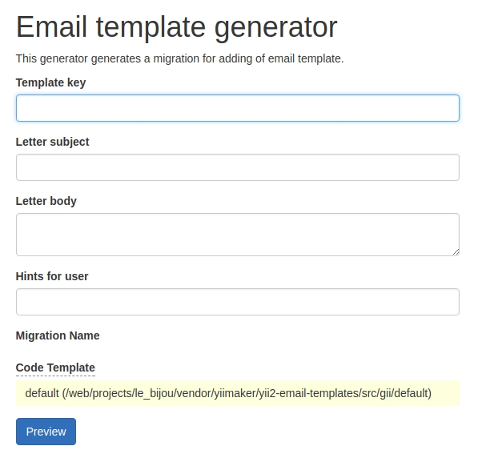

Gii генератор
=============

Вы можете создавать шаблоны писен через Gii!

Для этого вам необходимо настроить генератор модуля Gii в вашем конфиге приложения
как показанно ниже:

> Если вы используете advance template - поместите этот код в конфигурационный файл `backend/config/main-local.php`
> или `frontend/config/main-local.php`

```php
'modules' => [
    'gii' => [
        // ...
        'generators' => [
            // ...
            'email-templates' => ymaker\email\templates\gii\Generator::class,
        ],
    ],
],
```

Генератор создаёт миграцию для добавления шаблона в таблицу базы данных.

```php
<?php

use yii\db\Migration;
use ymaker\email\templates\entities\EmailTemplate;

/**
 * Handles creating of email template.
 *
 * Generated by `yiimaker/yii2-email-templates`.
 * @see https://github.com/yiimaker/yii2-email-templates
 */
class m180121_180103_add_email_template extends Migration
{
    /**
     * Migration table name.
     *
     * @var string
     */
    public $tableName = '{{%email_template}}';
    /**
     * Migration table name.
     *
     * @var string
     */
    public $translationTableName = '{{%email_template_translation}}';


    /**
     * @inheritdoc
     */
    public function safeUp()
    {
        $this->insert($this->tableName, [
            'key' => 'preview',
        ]);

        $templateId = EmailTemplate::find()
            ->select('id')
            ->where(['key' => 'preview'])
            ->scalar();

        $this->insert($this->translationTableName, [
            'templateId'    => $templateId,
            'language'      => Yii::$app->language,
            'subject'       => 'Hello',
            'body'          => 'Hello, {username}!',
            'hint'          => 'This is hint',
        ]);
    }

    /**
     * @inheritdoc
     */
    public function safeDown()
    {
        $this->delete($this->tableName, '[[key]] = :key', [
            ':key' => 'preview',
        ]);
    }
}
```

После генерации вам нужно запустить комманду `./yii migrate` в консоли.

## Превью генератора

